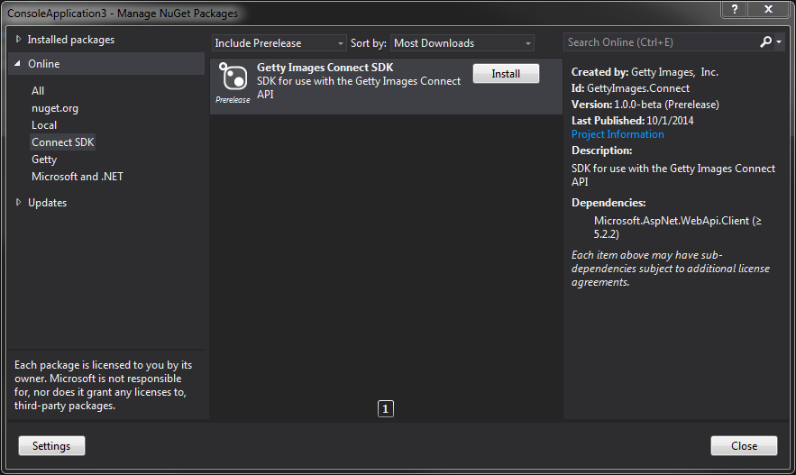

# Getty Images API SDK - .NET
[](https://ci.appveyor.com/project/GettyImages/gettyimages-api-dotnet/branch/master)  
[](https://gitter.im/gettyimages/gettyimages-api_dotnet?utm_source=badge&utm_medium=badge&utm_campaign=pr-badge&utm_content=badge)
## Introduction
This SDK makes using the Getty Images [API](http://developers.gettyimages.com) easy. It handles credential management, makes HTTP requests and is written with a fluent style in mind. The [API Documentation](https://github.com/gettyimages/gettyimages-api) is located on Github.

## Getting started
### Using the Nuget Package
The SDK is published to the public [Nuget](https://www.nuget.org/packages/GettyImages.Api/) package repository.

Open the package manager and add the package to your project:


## Usage
The SDK currently supports:
+ Searching for images
+ Getting image metadata
+ Creating download URLs

### Code
The SDK supports async operations, however it can also be used synchonously, such as when running in a console application:

```csharp
var client = ApiClient.GetApiClientWithClientCredentials("my_api_key", "my_api_secret");
var searchResult = client.Search()
    .Images()
    .Editorial()
    .WithEditorialSegment(EditorialSegment.News)
    .WithPhrase("all vocabulary")
    .WithSortOrder("newest")
    .ExecuteAsync()
    .Result;

foreach (var image in searchResult.images)
{
    Console.WriteLine("Title: {0} \r\nId: {1}", image.title, image.id);
}
````

Results are returned as `dynamic`. Visit the [API Interactive Documentation](https://api.gettyimages.com/swagger) to learn more about available parameters and to see what the response object look like.

### Building From Source Code
_This is only necessary if you would like to contribute to the project. Otherwise, use the [Nuget Package](#using-the-nuget-package)_

#### Assumptions
+ You have Visual Studio 2013 Update 4
+ You have Git installed
	+ [Git for Windows](http://msysgit.github.io/)
	+ If you are using Cygwin, use the [Cygwin Package Installer](https://cygwin.com/install.html) to install Git
+ You have the [SpecFlow](http://specflow.org) extension installed in Visual Studio

## Tests
The API team at Getty Images uses [Behavior Driven Development](http://en.wikipedia.org/wiki/Behavior-driven_development) (BDD). We think it's a great way to develop software and want to spread the word. The test project contains scenarios written in the [Gherkin language](https://github.com/cucumber/gherkin/wiki) which are bound to code using [SpecFlow](http://www.specflow.org/).

#### Clone the repository
The Git repository contains a submodule which requires some special handling to get setup properly. This is because we share our scenario files across all our SDKs.

Open a console window (Command Prompt, PowerShell or Bash) and issue the following commands to clone the Git repository:

	git clone git@github.com:gettyimages/gettyimages-api_dotnet.git
	pushd gettyimages-api_dotnet
	git submodule update --init
#### Build using Command Prompt or Powershell
	.\build.cmd

### Opening the code in Visual Studio and running tests
#### Setup environment variables
The tests expect credentials to be stored in environment variables.
+ __GettyImagesApi_ApiKey__: API key assigned when you registered
+ __GettyImagesApi_ApiSecret__: API secret assigned when you registered
+ __GettyImagesApi_UserName__: a Getty Images user. Create one at the [Getty Images website](http://gettyimages.com).
+ __GettyImagesApi_UserPassword__: Getty Images user's password


_Note: If you don't have user account credentials, some of the tests will fail. That's OK!_

Once this is complete, you can open the solution in Visual Studio:

1. Open the GettyImages.Api.sln file.
1. Build the solution.
1. Tests can be run using:
	+ ReSharper Unit Test Explorer
	+ NUnit - You may need to install the [NUnit Test Adapter](http://visualstudiogallery.msdn.microsoft.com/6ab922d0-21c0-4f06-ab5f-4ecd1fe7175d)
	+ Note: Running all tests at once can occasionally result in the error "GettyImages.Api.OverQpsException : Exception of type 'GettyImages.Api.OverQpsException' was thrown.". Please run tests individually if you encounter this error and the tests should run properly.
